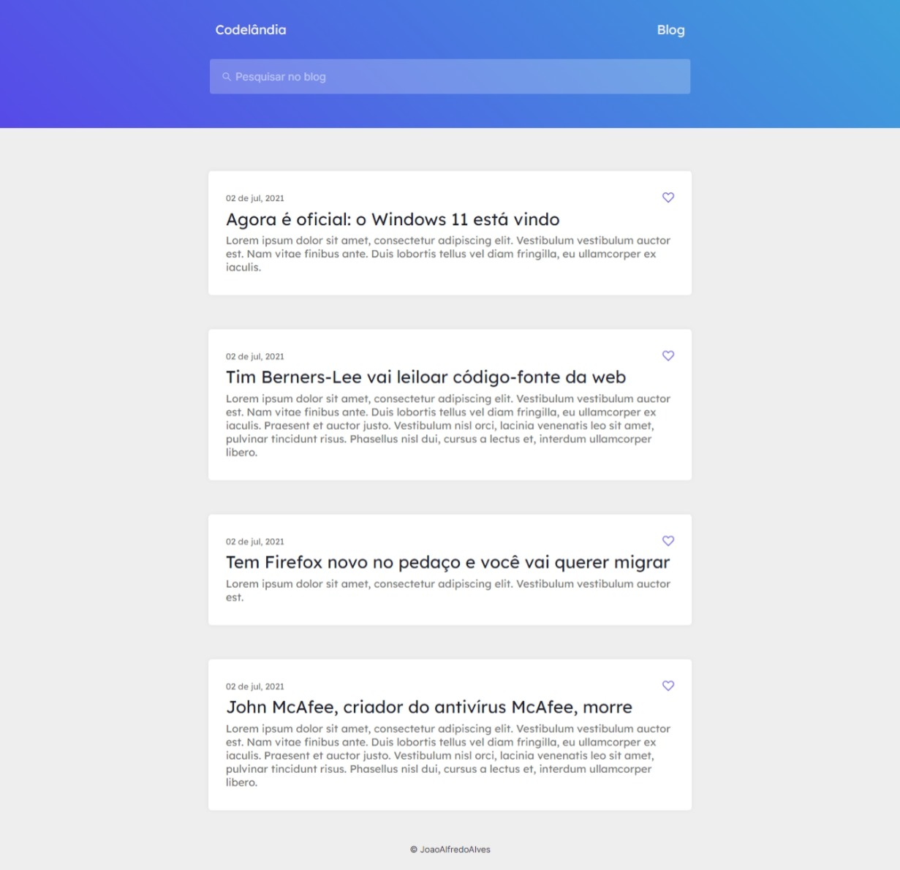

<h1 align="center">Desafio 1 - Codelândia</h1>
<h2 align="center">Codelândia Blog</h2>

 

 

 
Clique na Imagem para Acessar o <strong>Codelândia Blog</strong>!  Site que simula um blog de conteúdos de tecnologia.

---

 
## O que é o projeto Codelândia Blog e qual é o seu objetivo?

O projeto **Codelândia Blog** é uma aplicação web desenvolvida por **João Alfredo Alves**, criada e pensada como um desafio para desenvolvedores pelo desenvolvedor <a href="https://github.com/iuricode">Iuri Silva<a> com o objetivo de por em prática as funcionalidades de estruturação e práticas de estilização de **HTML** e **CSS** em um âmbito, também, responsivo.

---

## Linguagens e Tecnologias Usadas

- HTML 5
- CSS 3

---
 
## Por que o projeto é útil?

O projeto **Codelândia Blog** é útil para o treino e aprendizado das boas práticas de desenvolvimento web responsivo com HTML5 e CSS3.

---

## Onde encontrar desafios como este?

- <a href="https://discord.com/invite/QevDJqCzaY">Comunidade Codelândia no Discord</a>
  
- <a href="https://www.figma.com/file/Yb9IBH56g7T1hdIyZ3BMNO/Desafios---Codel%C3%A2ndia?node-id=0%3A1">Design da Página - FIGMA</a>

  

